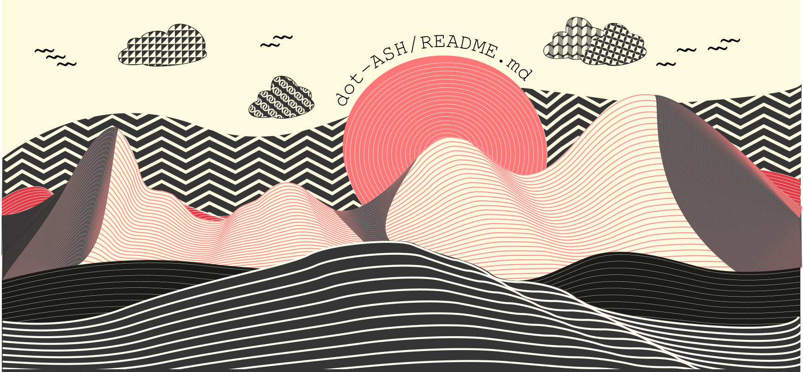

# Nafees Ashker Sakir
#### *Software Developer & Designer*

I do believe in the concept of engineering. The art of implementing traditional knowledge into practical applications vivifies me. I've always been passionate about design, interactive structure, in-depth writing, and how these influence human nature. I fancy myself creating and developing those stuffs. 
 
  

## Skills 

#### Software Development 

   

#### Development Languages

        

 
#### Language Framework

        

#### Database

  

#### Tools

     

#### Design and Art
       

#### OS

  
#### Documentation

 

